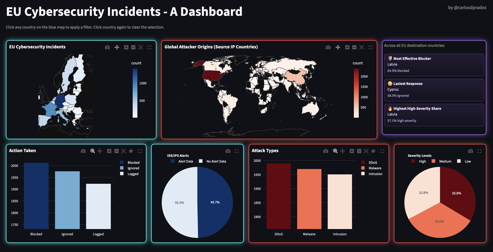
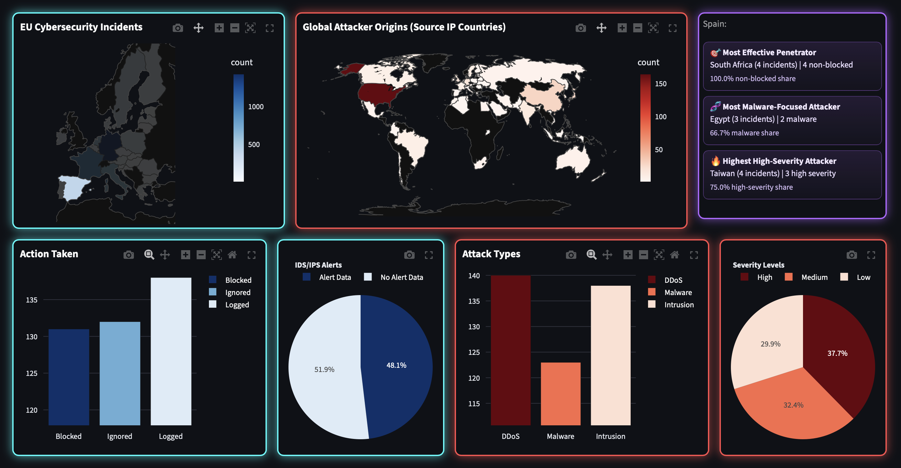

# EU Cybersecurity Incidents Dashboard

Interactive Streamlit dashboard that analyzes cyber incidents targeting EU countries, visualizes attacker origins, and highlights country-level insights.

## Highlights
- Interactive EU destination map (click-to-filter).
- Global attacker-origin map linked to current filter.
- Action Taken bar chart with fixed category color semantics.
- Attack Types bar chart with fixed category order and color semantics.
- Severity Levels and IDS/IPS Alerts pie charts with stable legend/category behavior.
- Resilient data loading: if external refresh fails (Kaggle/GeoLite), the app falls back to the committed processed CSV when available.
- Dynamic insights panel:
  - No country selected: cross-country benchmark insights.
  - Country selected: source-country attacker insights for that destination.

## Screenshots
Default dashboard view:



Filtered dashboard view (Spain selected):



## Current Dashboard Layout
- Top row:
  - EU incidents map (blue)
  - Global attacker origins map (red)
  - Insights panel (purple)
- Bottom row:
  - Action Taken bar chart
  - IDS/IPS Alerts pie chart
  - Attack Types bar chart
  - Severity Levels pie chart

## Data Flow and Architecture
1. `app.py` orchestrates UI state, map selection, and layout rendering.
2. `data_pipeline.py` orchestrates data preparation:
   - load raw Kaggle dataset
   - map IPs to countries via GeoLite2
   - filter to EU destination countries
   - export processed CSV
3. `utils/` modules separate concerns:
   - `data_loader.py`: dataset retrieval and raw caching
   - `geoip_utils.py`: IP-to-country mapping and EU filtering
   - `data_export.py`: processed dataset export
   - `aggregations.py`: reusable aggregation and insight calculations
   - `plot_utils.py`: Plotly chart construction and styling
   - `dashboard_service.py`: dashboard data orchestration and figure assembly
   - `ui_components.py`: reusable Streamlit UI/styling components

## Repository Structure
```text
eu-cyber-incidents/
├── app.py
├── data_pipeline.py
├── README.md
├── GeoLite2-Country.mmdb
├── data/
│   ├── raw/
│   └── processed/
├── tests/
│   ├── test_aggregations.py
│   ├── test_dashboard_service.py
│   ├── test_data_loader.py
│   ├── test_data_pipeline.py
│   └── test_geoip_utils.py
└── utils/
    ├── aggregations.py
    ├── data_export.py
    ├── data_loader.py
    ├── eu_countries.py
    ├── geoip_utils.py
    ├── plot_utils.py
    ├── dashboard_service.py
    └── ui_components.py
```

## Setup
1. Clone and enter the repository.
```bash
git clone https://github.com/carlosdprados/eu-cyber-incidents.git
cd eu-cyber-incidents
```

2. Create and activate a virtual environment.
```bash
python -m venv .venv
source .venv/bin/activate  # macOS/Linux
# .venv\Scripts\activate   # Windows PowerShell
```

3. Install dependencies.
```bash
pip install -r requirements.txt
pip install -r requirements-dev.txt
```

4. Place `GeoLite2-Country.mmdb` at the project root.
   - Download from MaxMind GeoLite2.

5. Ensure Kaggle credentials are configured for `kagglehub` access.

6. Run the dashboard.
```bash
streamlit run app.py
```

## Tests and Validation
Run full unit test suite:
```bash
python -m unittest discover -s tests -p "test_*.py" -v
```

Run compile check:
```bash
python -m compileall app.py data_pipeline.py utils
```

Run lint checks:
```bash
pip install -r requirements-dev.txt
ruff check .
```

## CI
GitHub Actions workflow (`.github/workflows/ci.yml`) runs on push/PR and validates:
- compile checks
- unit tests
- Ruff linting

## License
This project is licensed under the MIT License. See `LICENSE` for details.  
Dataset source: Kaggle (`teamincribo/cyber-security-attacks`).
